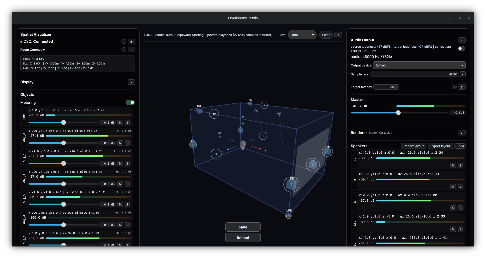

# Omniphony

Monorepo de convergence pour la suite Omniphony.

Omniphony regroupe deux composants principaux :

- `omniphony-renderer/` : moteur temps réel de décodage, rendu spatial et contrôle OSC
- `omniphony-studio/` : application de supervision, visualisation 3D, contrôle live et gestion de layout

Le but de ce dépôt est de faire converger progressivement les anciens projets séparés vers un dépôt unique.

## Donations

Si Omniphony t’est utile, tu peux soutenir le projet avec un don. Cela aide à maintenir et faire évoluer la suite.

## Composants

### `omniphony-renderer`

`omniphony-renderer` est le moteur principal de la suite.

Il charge un bridge de format au runtime, décode le flux d'entrée, puis peut :

- envoyer l'audio décodé vers un backend temps réel
- produire des sorties `pipewire` sur Linux ou `asio` sur Windows
- émettre des métadonnées et du metering en OSC
- rendre les objets vers des feeds enceintes avec VBAP
- charger des layouts d'enceintes et des tables VBAP pré-calculées

Le projet contient aussi la pile technique du moteur :

- `renderer` : moteur VBAP, layouts, sortie OSC, config runtime
- `audio_output` : backends PipeWire et ASIO
- `spdif` : parsing IEC61937 / S/PDIF
- `bridge_api` : interface ABI stable pour les bridges externes
- `sys` : intégration plateforme, y compris le support service Windows

### `omniphony-studio`

`omniphony-studio` est l'interface de supervision et de pilotage de la suite.

Ce composant ne produit pas le rendu audio lui-même. Il se connecte au renderer via OSC pour :

- visualiser les objets et sources dans une scène 3D
- suivre l'état runtime exposé par le moteur
- recevoir les positions, niveaux et informations de layout
- s'enregistrer automatiquement auprès du renderer
- maintenir la session par heartbeat OSC
- piloter certains paramètres live côté moteur

Le studio accepte plusieurs formats OSC d'entrée, y compris :

- positions cartésiennes historiques
- positions avec identifiant dans l'adresse
- coordonnées sphériques `azimuth/elevation/distance`
- suppression explicite de sources

## Arborescence

- `omniphony-renderer/`
- `omniphony-studio/`
- `assets/`
- `scripts/`
