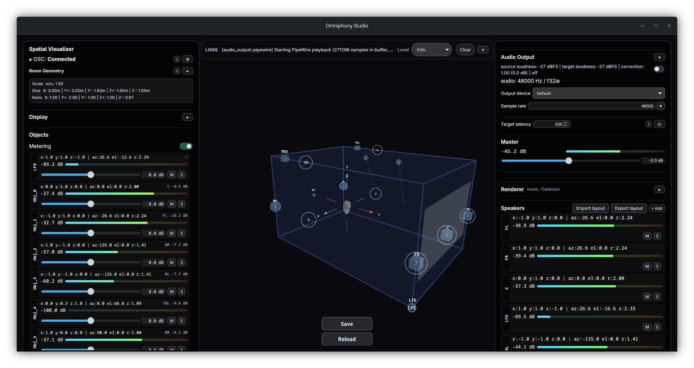

# Omniphony

**A real-time spatial / object-based audio rendering engine.** Omniphony takes
multichannel and object audio and renders it — with VBAP — to any speaker layout
or to **binaural headphones**, in real time. Open source, GPL-3.0.

[](https://omniphony.mgth.fr)

[](https://github.com/mgth/Omniphony/releases/latest)
<!-- The player lives under the mpv-v* tag namespace, which /releases/latest never
     resolves to (that is the Studio v* line) — bump these two on each mpv release. -->
[](https://github.com/mgth/Omniphony/releases/tag/mpv-v0.6.0)
[](https://github.com/mgth/Omniphony/releases/tag/mpv-v0.6.0-fel-beta.2)

**Play a film through Omniphony, step by step:**
[Linux](docs/install/linux.md) · [Windows](docs/install/windows.md) · [macOS](docs/install/macos.md)
— what to download, where each file goes, how to check each step, and the usual
failures.



- 🎧 **Hear it on headphones** — binaural output (HRTF + ITD + live head-tracking),
  no surround rig required.
- 🔊 **Render to any layout** — stereo, 5.1, 7.1, 7.1.4 and beyond, via VBAP.
- 🧩 **Pluggable decoders** — a small, versioned ABI (`bridge_api`) loads decoder
  bridges at runtime; bring your own format.
- 🛰️ **Live control + 3D visualization** — Omniphony Studio supervises the engine
  over OSC.

## Hear it in 2 minutes — no media player needed

The engine ships a self-contained demo: a reference WAV decoder bridge plus a
short multichannel clip. From a fresh clone, with a Rust toolchain, on Linux,
macOS or Windows (Git Bash; the device modes play through ASIO when an ASIO driver
is installed, and through WASAPI shared mode otherwise):

```sh
cd omniphony-renderer
./scripts/demo.sh            # builds the engine, then plays the demo on your headphones
```

`scripts/demo.sh` binaurally renders `assets/demo/spatial-demo.wav` — a source
sweeping around you with an overhead tone — straight to your headphones. No
external player, no proprietary decoder. Other modes:

```sh
./scripts/demo.sh speakers   # 7.1.4 speaker render instead of binaural
./scripts/demo.sh file       # no audio device? pipe raw float to ffplay
```

## Frontends

Omniphony is the engine; you can drive it three ways:

| Frontend | What it is |
| --- | --- |
| **`orender` CLI** | The standalone engine binary — render a stream or file to speakers, headphones, or a file/pipe. The demo above uses it. |
| **Omniphony Studio** | Desktop app: 3D visualization, live control, metering, layout management. Prebuilt bundles on the [releases page](https://github.com/mgth/Omniphony/releases/latest) (Linux / Windows / macOS). |
| **[mpv-omniphony](docs/mpv-omniphony.md)** | The [mpv](https://mpv.io/) media player with an opt-in spatial decoder (`--ad=orender`) that renders through the engine instead of downmixing. ([usage guide](docs/mpv-omniphony.md) · [source](https://github.com/mgth/mpv-omniphony)) |

[](docs/mpv-omniphony.md)

## Install on Arch

The stack is packaged on the AUR — built from source, managed by pacman like
everything else:

```sh
paru -S mpv-omniphony omniphony-studio
```

[`mpv-omniphony`](https://aur.archlinux.org/packages/mpv-omniphony) replaces the
stock mpv (`provides mpv` + `libmpv`) and pulls in
[`orender`](https://aur.archlinux.org/packages/orender) — the engine package with
the CLI and `liborender.so`, installable on its own for a player-less setup.
[`omniphony-studio`](https://aur.archlinux.org/packages/omniphony-studio) is the
Studio app, running against that system engine rather than a bundled copy. Movie
discs carrying a video enhancement layer want
[`mpv-omniphony-fel`](https://aur.archlinux.org/packages/mpv-omniphony-fel)
instead of the plain player package: same spatial decoder on an mpv master
snapshot, plus Dolby Vision Profile 7 FEL reconstruction. Decoder bridges install
the same way — search the AUR for the one your format needs.

## Which versions go together

One release number covers Omniphony Studio, the `orender` engine
and `liborender`. The player and the decoder bridges are released on their own,
and each must match the engine it runs with: the player needs a `liborender`
with its ABI major version, and a decoder bridge loads only in an engine built
against the same `bridge_api` minor version (the engine says which one it
expects in its log and in Studio's About box). Each release also carries this
row as `omniphony-<release>-manifest.json`.

<!-- compat-table:start -->
| Release (Studio, orender, liborender) | liborender ABI | Player | Decoder bridge built against `bridge_api` |
| --- | --- | --- | --- |
| [v0.7.0](https://github.com/mgth/Omniphony/releases/tag/v0.7.0) | 0.12 | [mpv-v0.7.0](https://github.com/mgth/Omniphony/releases/tag/mpv-v0.7.0) | 0.6.x |
| [v0.6.0](https://github.com/mgth/Omniphony/releases/tag/v0.6.0) | 0.8 | [mpv-v0.6.0](https://github.com/mgth/Omniphony/releases/tag/mpv-v0.6.0) | 0.4.x |
| [v0.5.2](https://github.com/mgth/Omniphony/releases/tag/v0.5.2) | 0.7 | [mpv-v0.5.2](https://github.com/mgth/Omniphony/releases/tag/mpv-v0.5.2) | 0.3.x |
| [v0.5.1](https://github.com/mgth/Omniphony/releases/tag/v0.5.1) | 0.6 | [mpv-v0.5.0](https://github.com/mgth/Omniphony/releases/tag/mpv-v0.5.0) | 0.3.x |
| [v0.5.0](https://github.com/mgth/Omniphony/releases/tag/v0.5.0) | 0.6 | [mpv-v0.5.0](https://github.com/mgth/Omniphony/releases/tag/mpv-v0.5.0) | 0.3.x |
<!-- compat-table:end -->

## How it works

`omniphony-renderer` loads a **format bridge** at runtime (a `.so` / `.dll`
implementing the `bridge_api` ABI), decodes the input to PCM + object metadata,
and renders it:

- VBAP object → speaker-feed rendering, with loadable speaker layouts and
  precomputed VBAP tables
- real-time output backends — `pipewire` (Linux), `asio` (Windows, falling back
  to WASAPI shared mode without an ASIO driver), CoreAudio
  (macOS), plus a non-realtime **file / stdout / FIFO** backend
- binaural headphone output — HRTF, ITD, early reflections, live head-tracking
- metadata and metering over OSC

The reference bridge in `omniphony-renderer/reference_bridge/` (used by the demo)
is the smallest example of how to add your own decoder. See
[`omniphony-renderer/BRIDGE_API.md`](omniphony-renderer/BRIDGE_API.md).

## Components

### `omniphony-renderer` — the engine

The core engine (executable: `orender`) and its supporting crates:

- `renderer` — VBAP engine, layouts, binaural, OSC output, runtime config
- `audio_output` — PipeWire / ASIO / CoreAudio / file backends
- `audio_input` — live PCM / bridge input
- `bridge_api` — the versioned ABI for external decoder bridges (a bridge
  loads in a host built against the same `bridge_api` minor; see
  [`BRIDGE_API.md`](omniphony-renderer/BRIDGE_API.md))
- `reference_bridge` — a reference WAV/PCM decoder bridge (powers the demo)
- `spdif` — IEC 61937 / S/PDIF parsing
- `sys` — platform integration (incl. Windows service)
- `diag` — diagnostic-metric registry feeding the Studio diag plot
- `live_log` — process logger with a runtime log level and live log streaming

Start with [`omniphony-renderer/QUICKSTART.md`](omniphony-renderer/QUICKSTART.md).

### `omniphony-studio-egui` — Omniphony Studio, supervision & control

A native (egui/wgpu) desktop app that does **not** render audio itself; it
connects to the engine over OSC to visualize objects in a 3D scene, monitor
runtime state, and control selected live parameters. Since 0.7.0 it is the
only Studio: the previous web-based (Tauri) Studio was removed, and the AUR
`omniphony-studio` package now installs this one.

## Repository layout

- `omniphony-renderer/` — engine, CLI, crates, reference bridge
- `omniphony-studio-egui/` — Omniphony Studio, the supervision / visualization app
- `docs/` — frontend usage guides (e.g. [mpv-omniphony](docs/mpv-omniphony.md))
- `assets/` — demo clip, logo, captures
- `scripts/` — helpers

## Supported platforms

"Tested" means the CI gate on every pull request to `main` builds the code and
runs its test suite on that platform; "packaged" means a release ships a
prebuilt download for it.

| Platform | Engine (`orender`, `liborender`) | Studio | Packaged |
| --- | --- | --- | --- |
| Linux x86_64 | tested | tested | yes — Studio bundle, `liborender`, AUR (from source) |
| Windows x86_64 | tested | tested | yes — Studio bundle, `liborender` |
| macOS arm64 (Apple Silicon) | tested | tested | yes — Studio bundle, `liborender` |
| Linux arm64 (aarch64) | tested | not built | no — build from source |

Tests that need a sound device or a running PipeWire
session are skipped by CI on every platform, so the audio backends themselves
(PipeWire, ASIO, CoreAudio) are compiled but not exercised there. Anything not listed — macOS on Intel, 32-bit targets — is not built by
CI.

## License

GPL-3.0-or-later — see [`LICENSE`](LICENSE). Decoder bridges are loaded at runtime
via `dlopen` and may be licensed separately.

## Support

If Omniphony is useful to you, you can support development with a donation — it
helps maintain and improve the suite.

[](https://github.com/sponsors/mgth)
[](https://ko-fi.com/G5X022D1RW)
[](https://liberapay.com/mgth/donate)
