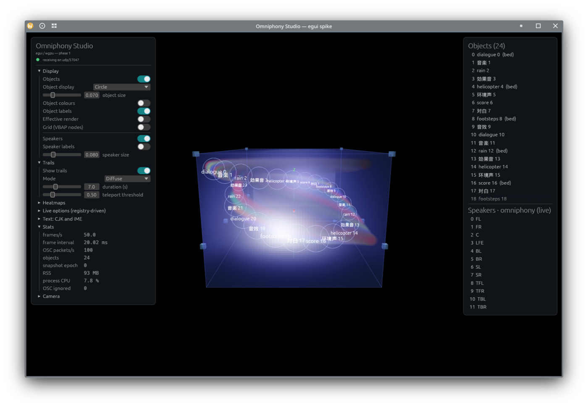

# Studio native UI, phase 1: viewport parity

Date: 10 September 2026. Branch `feat/studio-egui-viewport`, crate
[`omniphony-studio-egui/`](../omniphony-studio-egui/). Follows the phase 0
spike ([results](studio-native-ui-spike.md)). Goal of the phase: draw what the
Tauri Studio's three.js viewport draws, from the same OSC data, with the same
rules. Everything below was ported from the JavaScript file by file, using a
written specification of each visual element (geometry, material, blending,
render order, state rules, data source) extracted from the sources first; those
specifications are in [`studio-native-ui-specs/`](studio-native-ui-specs/).



## Architecture

- **Model reuse.** The Tauri host's `osc_parser.rs`, `app_state.rs`,
  `layouts.rs` and the `apply_*_domain_state` functions plus the chunked
  gain-table reassembly of `osc_listener.rs` are copied verbatim into
  `src/osc/parser.rs`, `src/model/` and `src/osc/apply.rs` (the decoders now
  return typed `GainTable`s instead of base64 JSON). A dispatcher
  (`src/osc/dispatch.rs`) applies every `OscEvent` to `AppState` exactly as
  the host's `handle_event` does, minus the webview emits; UI-only mirrors
  (head pose, object sizes, trails, decoded gain tables, schemas, meter
  timestamps) live next to it in `Live`. There is no camelCase re-modelling
  layer: the UI reads the model.
- **Renderer** (`src/render/`). Instanced unit meshes (sphere, cube, quad,
  cone, disc, glTF head) with a full model matrix, linear RGBA and an
  emissive/gloss or unlit flag; depth-tested and overlay line lists; world-
  sized billboard sprites (additive halos); pixel-sized point sprites
  (trails); ray-marched 3D-texture volumes. Draw order follows three.js:
  opaque, then blended sorted by render order and distance, then points,
  overlay lines, volumes. Lighting mirrors `scene/setup.js` (key, fill,
  ambient, hemisphere) with the physical `albedo / π` convention.
- **View** (`src/view/`). Pure functions from the model to a `FrameData`:
  `objects.rs` (display modes, colours, level scaling, badges,
  effective-render centroids), `speakers.rs` (cubes, band colours, level
  scaling, selection tint and fade), `room.rs` (box, edges, far-side faces,
  screen plane, axes, face shadows, VBAP grids), `trails.rs` (diffuse and
  line modes), `volumes.rs` (the four field providers). Coordinates go
  through `omniphony-geometry` (`room_scaled_position`, `adm_to_scene`,
  `inverse_map_depth`), so the room warp is the renderer's, not a copy.
- **Camera** (`src/render/camera.rs`): OrbitControls semantics (65°, near
  0.1, pivot `(0, 0.25, 0)`, eye `(-3.8, 1.1, 0)`, damping 0.06, rotate by
  viewport height, dolly `0.95^x`, right-drag lens shift).

## Ported

| Area | What | Notes |
|---|---|---|
| Objects | Circle / transparent-sphere / diffuse-sphere modes; `#ff7c4d` default, 16-colour palette when object colours are on, A/B tag colours; RMS level scale 0.5..2.4 with the 250 ms hold and 45 dB/s decay; selection ring `#ffde8a`; speaker-contribution tint and opacity tables; metadata-silent hiding; snap to a direct speaker; badge codes (`Phantom_L_C` → `L·C`, `DirectH_X` → `X↑`, …) centred on the mesh at the sprite's size; effective-render marker and line | Labels are egui text at the sprite's projected height, sizes rounded to whole points |
| Speakers | 0.08 cubes, `#8ec8ff` / emissive `#10253a`, α 0.65 (0.3 when not spatialised), band colour ramp from crossover cutoffs, RMS scale 0.65..2.2, lerp to `#ff3030` by the selected object's gain, unfed speakers fade to 0.08, `#4dff88` when selected, optional labels at +0.12 | Driver disc and face-the-listener orientation not yet |
| Room | Fill `#4d6eff` α 0.08, 12 edges `#6f8dff` α 0.45 without depth test, six faces `#233047` α 0.18 shown only on the camera's far side, 16:9 screen plane fitted to the front wall, room-ratio warp incl. rear/lower/centre-blend | Room dimension guides not yet |
| Axes | Y red (depth), Z green (up), X blue (right): gap 0.3, extent 0.58, cones, labels | |
| Head | Dame de Brassempouy glTF (39 677 vertices, vertex colours), node transform, `rotation.y = −π/2`, largest extent 0.34; head pose from `/omniphony/state/head_pose` only in binaural output mode, conjugate-and-permute mapping, slerp 0.4 per frame | Placeholder sphere when the asset is missing |
| Trails | 70 ms minimum interval, 240-point ring, 7 s TTL, teleport gaps at 0.5; diffuse mode as pixel-sized sprites (size, glow and alpha ramps, `0.95^…` loudness factor, silent points skipped); line mode with the 0.2..1 colour ramp at α 0.6; trail colour = base colour offset in HSL | Recorded on the OSC thread on each position update |
| Selection | Click picks speakers first, then objects; Escape clears; six face shadows on the walls for the selected element | Hover feedback none, as in the Studio |
| Energy volumes | Object energy field (inverse-square, client-side), global energy deviation (table −1, red/blue by dB), speaker heatmap (single band or level-weighted all-bands colouring), discontinuity (tables −2/−3, amber). `n³` field sampled at the texel centres through the inverse depth warp, 160 ms refresh, signatures for the static providers, five colormaps with custom stops, accumulate/MIP mix, gamma pair, nearest or linear sampling | RGBA16F instead of RGBA32F; gain-table subscriptions with the 5 s repair heartbeat go through the listener |
| VBAP grids | Evaluation-grid nodes on the visible faces, `#66d8ff` α 0.42 | Off by default, as in the Studio |
| Transport | Register/heartbeat/re-register, coordinate format, spatial-frame resets and stale-slot inference, removals, meta, sizes, meters (object/speaker/ear/master/DRC), per-speaker and per-band gains, speaker state events, all `/state/*` domain documents, options/phantom/generator schemas, latency and timing fields, gain-table meta/chunk/NACK | |

## Measurements

Same machine as phase 0 (KDE Wayland, RX 7900 XTX, primary output at 50 Hz);
release build; process CPU as a share of one core.

| Load | Frame rate | CPU | RSS |
|---|---|---|---|
| 12 objects at 100 Hz, trails | 50 fps (display) | 3 % | 85 MB |
| 64 objects at 100 Hz, trails | 50 fps | 6 % | 90 MB, flat over 30 s |
| 24 objects at 100 Hz, trails + object energy field at 64³ | 50 fps | 8 % | 89 MB |
| 64 objects at 100 Hz, trails + object energy field at 64³ | 50 fps | 15 % | 91 MB |
| Idle after the feed stops | 0 frames | 0 ticks / 10 s | 88 MB |

The first 64-object run of this phase grew from 155 MB to 372 MB in ten
seconds at 23 % CPU: perspective-scaled labels produced a new font size every
frame and egui rasterises one glyph cache per distinct size. Rounding label
sizes to whole points fixed both figures.

## Not covered by this pass

All of the viewport work listed here as missing was finished in the panels
phase; see [`studio-native-ui-phase2.md`](studio-native-ui-phase2.md) for the
gizmos and their dragging, the room dimension guides, the speaker band bars and
the driver disc, the hybrid iso-distance shape, binaural ghosting, the editor
pin, and the panels-phase items (preference persistence, the gradient editor,
the band cursor, the scene-effects toolbar, mpv overlay mirroring). What remains
below is what was still true when this pass ended:

- Material fidelity: `MeshPhysicalMaterial` (clearcoat, sheen) is
  approximated by a Blinn-Phong with a rim term; label text is egui's
  proportional face rather than a bold sans sprite.
- Verified only against the synthetic feed. Gain-table volumes, speaker gain
  tinting, head pose, room-ratio changes and the live layout need a renderer
  session to confirm.

## Running

```bash
cd omniphony-studio-egui
cargo run --release -- --synthetic 24 --rate 100 --object-field
cargo run --release -- --register 127.0.0.1:9000
```

`--register` is read-only for audio: the only messages sent are register,
heartbeat and the gain-table debug subscriptions the enabled volumes need.
