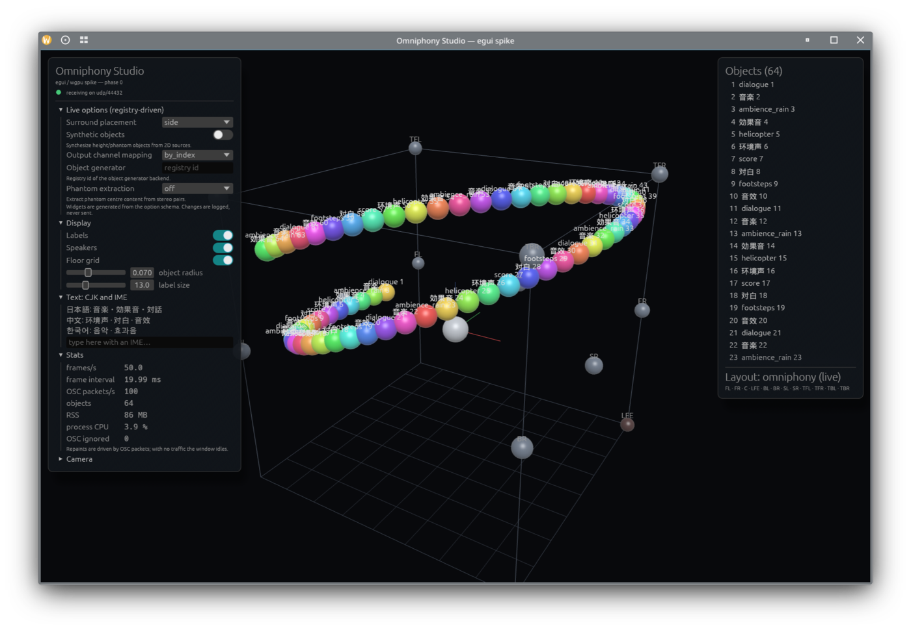

# Studio native UI spike — phase 0 results (egui/eframe)

Date: 10 September 2026. Branch `spike/studio-egui`, crate
[`omniphony-studio-egui/`](../omniphony-studio-egui/). Follow-up to the
frontend replacement study that ranked egui/eframe first among ten Rust UI
frameworks for hosting Studio's wgpu viewport.

The spike answers the phase 0 questions with numbers measured on one machine.
It is not a Studio replacement: no energy volumes, no trails, no option
round-trips to the renderer, no Windows or macOS build.

## What was built

- eframe 0.36.2 + wgpu 30.0.1 (Rust 1.97.1), about 2420 lines of Rust and WGSL.
- The 3D viewport is an `egui_wgpu::Callback`: the scene renders in `prepare`
  into an offscreen 4× MSAA colour + depth target sized to the widget in
  physical pixels, and `paint` composites it into egui's pass with one
  full-screen triangle. The device and queue are egui's; nothing crosses the
  CPU. This is the pattern Rerun uses.
- Instanced lit spheres for objects, speakers (from `layouts/7.1.4.yaml`) and
  the listener; room box, floor grid and axis triad as lines; orbit, pan and
  zoom; ray picking on click; labels drawn as egui text projected from the 3D
  positions.
- The same OSC addresses as the Tauri Studio for positions, meta and removals
  (`/omniphony/object/<id>/xyz|aed|meta`, the `/source/...` forms), optional
  registration and heartbeat with a live renderer (read-only), and a synthetic
  feed that pushes N objects at 100 Hz through the real socket and parser.
- Left panel floated over the viewport with a fixed width and internal
  scrolling: five widgets generated from a copy of the renderer's option
  registry (switch for `Bool`, combo for `Enum`, text field for `Str`), display
  switches, a CJK sample block with an IME text field, live stats. Right panel:
  object list with selection, layout summary. Panel expansion cannot change
  the viewport size by construction.
- Repaints are requested by the OSC thread when a packet changed the scene
  (coalesced to one request per 2.5 ms) and by user input. Nothing else.

## Measurements

Machine: Linux 7.2.3, KDE Plasma on Wayland, AMD Radeon RX 7900 XTX (RADV,
Mesa 26.2.2), Ryzen 9 9950X. Primary output 3840×2160 at 50 Hz. Release build
with fat LTO, stripped. CPU figures are utime + stime of the whole process from
`/proc`, as a share of one core.

| Gate | Target | Result | Verdict |
|---|---|---|---|
| Frame rate, 64 objects at 100 Hz | 60 fps | 50.0 fps, 20.0 ms interval, 3–5 % CPU. Equal to the output's refresh rate: on Wayland winit redraws on compositor frame callbacks, so the app can never exceed the display. Under XWayland without vsync: 200 fps, 5.2 ms per frame, 10 % CPU | pass (display-bound) |
| Frame rate, 256 objects at 100 Hz | headroom | 50.0 fps at the refresh rate, 6–8 % CPU | pass |
| Idle after a burst | 0 % CPU, no frames | 0–1 clock tick over 10 s (≤ 0.1 %), 0 frames rendered; pure idle without any feed: 0 ticks, 0 frames | pass |
| Resident memory | under 150 MB | 81–93 MB with 64 objects, 85 MB empty; 18–21 threads | pass |
| Binary size | information | 17.1 MB (CJK font read from the system at runtime, not bundled) | — |
| CJK labels | rendered | Japanese, Chinese and Korean strings render through a system DroidSansFallbackFull face added as a fallback family; without such a face egui shows boxes | pass, font to bundle for shipping |
| IME composition | works in a text field | not verified: requires a person typing with an input method in the "Text: CJK and IME" field | open |

Reproduce with `scripts/measure.sh 64 100 20` (vsync, feed stops at 20 s,
screenshot at 15 s) and, for the unthrottled rate,
`env -u WAYLAND_DISPLAY DISPLAY=:1 target/release/omniphony-studio-egui --no-vsync --synthetic 64 --stats-interval 1`.

## Observations

- Two early idle measurements showed 25–50 fps and 2–3 % CPU after the feed
  had stopped. Adding input-event counters to the stats line showed those
  frames were pointer-driven (the window was being interacted with); with no
  input the process sleeps completely. Keep the counters: they make this
  distinction cheap to establish.
- egui renders two frames per external repaint request (200 fps for 100
  requests per second under X11). Harmless, and invisible under Wayland
  pacing; the listener's coalescing window could be widened to the frame
  interval if it ever matters.
- CPU cost of a full frame, including re-layout of both panels and the label
  projection: about 0.6–0.8 ms for 64 objects and 1.4 ms for 256, measured as
  process CPU divided by frame count. Rendering is not the bottleneck at any
  Studio-relevant object count.
- Resident memory is dominated by the Vulkan driver and egui's font atlas, as
  in the hello-world measurement (74 MB); the scene adds under 10 MB.
- The wgpu callback API was straightforward: one trait with `prepare` and
  `paint`, resources in a type map, DPI and clipping supplied by egui. The
  only subtlety is that egui's own pass has no depth attachment, hence the
  offscreen target.
- egui 0.36 API differences from older examples: `App::ui` instead of
  `App::update`, `Context::content_rect` instead of `screen_rect`,
  `Frame::NONE`, `corner_radius`; wgpu 30: `DepthStencilState` fields are
  `Option`, `PipelineLayoutDescriptor::bind_group_layouts` takes `Option`s,
  `immediate_size` replaces push-constant ranges.

## Not covered by the spike

- Energy-volume grids and trails (the two custom GLSL shaders), object
  appearance modes, gizmos, head pose.
- Sending option changes to the renderer; the panel only logs them.
- Windows and macOS builds and runs; GNOME and Hyprland sessions (only KWin
  was used; egui issues #8523 and #8314 concern other compositors).
- Accessibility labels on the custom switch beyond the checkbox role.

## Recommendation

Phase 0 holds: proceed to phase 1 (viewport parity) on egui. Bundle a CJK
font subset for shipping, keep the OSC-driven repaint policy, and validate IME
by hand on each platform during phase 1.
