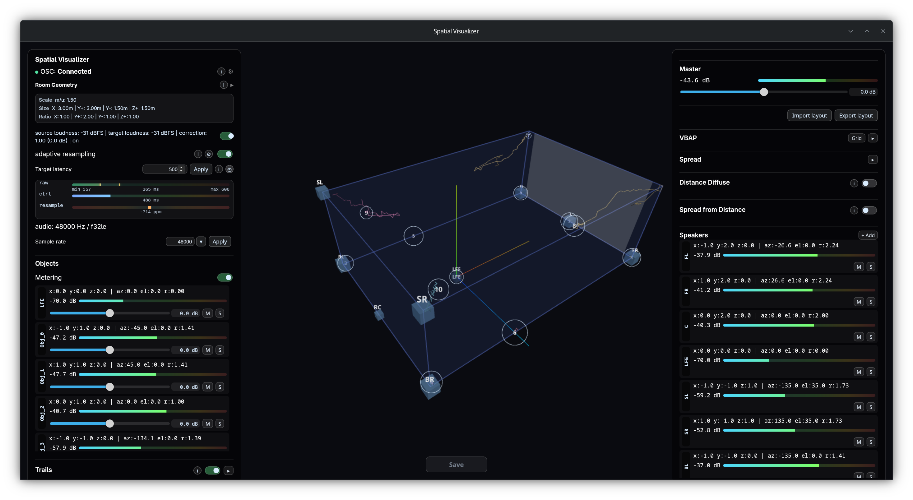

# omniphony-renderer



`omniphony-renderer` is the realtime decode and spatial rendering engine of the Omniphony suite.

The main executable is `orender`.

It loads a bridge plugin at runtime, decodes the input stream, and can then:

- stream decoded audio to realtime backends
- output through `pipewire` on Linux or `asio` on Windows
- emit OSC metadata and metering under the `/omniphony/...` namespace
- render objects to speaker feeds with VBAP

The repository also contains the supporting runtime stack:

- `renderer`: VBAP engine, speaker layouts, OSC output, runtime config
- `audio_output`: PipeWire and ASIO backends
- `spdif`: IEC61937 / S/PDIF parsing helpers
- `bridge_api`: ABI-stable interface for external bridge plugins
- `sys`: platform integration, including Windows service support

## Status

`omniphony-renderer` is still an engineering build. The CLI, rendering path, config system and platform backends are usable, but the project should still be treated as alpha.

## Build

Rust `1.87.0` or newer is required.

Minimal build:

```bash
cargo build --release
```

Linux with PipeWire output:

```bash
cargo build --release --features pipewire
```

Linux or Windows with runtime VBAP table generation:

```bash
export SAF_ROOT="/path/to/Spatial_Audio_Framework"
cargo build --release --features saf_vbap
```

Windows with ASIO output:

```bash
set CPAL_ASIO_DIR=C:\path\to\asio_sdk
cargo build --release --features asio
```

See [BUILD.md](BUILD.md) and [BUILDING_WINDOWS.md](BUILDING_WINDOWS.md) for the full dependency setup.

## Runtime Model

`omniphony-renderer` does not hardcode a single container or codec frontend in the binary itself. Decoding is delegated to a bridge plugin loaded at runtime.

Bridge lookup order:

1. `--bridge-path <FILE>`
2. `render.bridge_path` in the config file
3. first `lib*_bridge.so`, `lib*_bridge.dll` or `lib*_bridge.dylib` found next to the executable

Without a bridge plugin, `orender` will not start.

## Commands

`orender` currently exposes these commands:

- default command: render an input stream to a realtime backend
- `generate-vbap`: generate a binary VBAP table from a speaker layout
- `list-asio-devices`: list available ASIO output devices on Windows builds

Inspect the exact CLI supported by your build with:

```bash
orender --help
```

## Typical Usage

```bash
# Decode from stdin
cat input.bin | orender - --bridge-path ./libformat_bridge.so

# Linux realtime output via PipeWire
orender input.bin \
  --bridge-path ./libformat_bridge.so \
  --output-backend pipewire

# Enable VBAP rendering and OSC output
orender input.bin \
  --bridge-path ./libformat_bridge.so \
  --enable-vbap \
  --speaker-layout layouts/7.1.4.yaml \
  --osc \
  --osc-host 127.0.0.1 \
  --osc-port 9000
```

## Configuration

Global and render settings are loaded from a YAML config file.

Default path:

- Linux: `~/.config/omniphony/config.yaml`
- Windows: `%APPDATA%\\omniphony\\config.yaml`

You can point to another file with `--config`, and persist the current effective settings with `--save-config`.

## Repository Pointers

- [BUILD.md](BUILD.md): build profiles and feature flags
- [OSC_PROTOCOL.md](OSC_PROTOCOL.md): OSC message surface
- [QUICKSTART.md](QUICKSTART.md): local bring-up notes
- [layouts/README.md](layouts/README.md): speaker layout format
- [BRIDGE_API.md](BRIDGE_API.md): runtime bridge ABI
