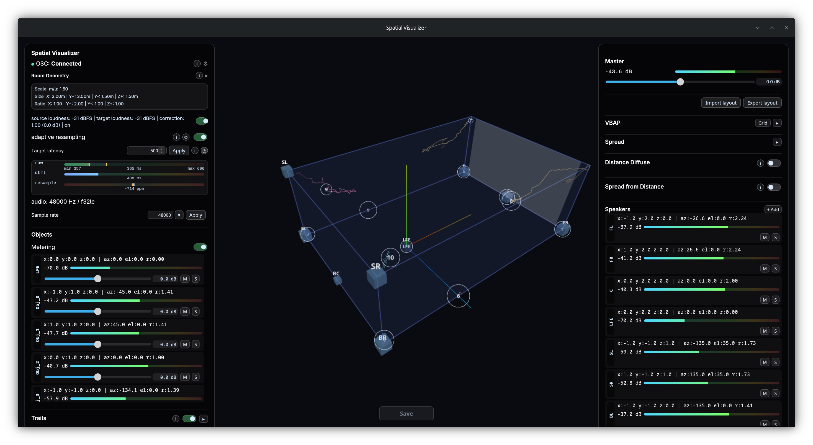

# omniphony-renderer



`omniphony-renderer` is the realtime decode and spatial rendering engine of the Omniphony suite.

The main executable is `orender`.

It loads a bridge plugin at runtime, decodes the input stream, and can then:

- stream decoded audio to realtime backends
- output through `pipewire` on Linux or `asio` on Windows
- emit OSC metadata and metering under the `/omniphony/...` namespace
- render objects to speaker feeds with VBAP

The repository also contains the supporting runtime stack:

- `renderer`: VBAP engine, speaker layouts, OSC output, runtime config
- `audio_output`: PipeWire and ASIO backends
- `spdif`: IEC61937 / S/PDIF parsing helpers
- `bridge_api`: ABI-stable interface for external bridge plugins
- `reference_bridge`: a reference WAV/PCM bridge that powers the bundled demo
- `sys`: platform integration, including Windows service support

## Status

`omniphony-renderer` is still an engineering build. The CLI, rendering path, config system and platform backends are usable, but the project should still be treated as alpha.

## Build

Rust `1.87.0` or newer is required.

Minimal build:

```bash
cargo build --release
```

Linux with PipeWire output:

```bash
cargo build --release --features pipewire
```

Linux or Windows with runtime VBAP table generation:

```bash
export SAF_ROOT="/path/to/Spatial_Audio_Framework"
cargo build --release --features saf_vbap
```

Windows with ASIO output:

```bash
set CPAL_ASIO_DIR=C:\path\to\asio_sdk
cargo build --release --features asio
```

See [BUILD.md](BUILD.md) and [BUILDING_WINDOWS.md](BUILDING_WINDOWS.md) for the full dependency setup.

## Runtime Model

`omniphony-renderer` does not hardcode a single container or codec frontend in the binary itself. Decoding is delegated to a bridge plugin loaded at runtime.

Bridge lookup order:

1. `--bridge-path <FILE>`
2. `render.bridge_path` in the config file
3. first `lib*_bridge.so`, `lib*_bridge.dll` or `lib*_bridge.dylib` found next to the executable

Without a bridge plugin, `orender` will not start.

The repo ships a **reference bridge** (`reference_bridge/`, built as
`libreference_bridge.so`) that reads a plain multichannel WAV. It powers the
one-command demo — `./scripts/demo.sh`, see [QUICKSTART.md](QUICKSTART.md) — and is
the smallest example for writing your own bridge ([BRIDGE_API.md](BRIDGE_API.md)).

## Commands

`orender` currently exposes these commands:

- default command: render an input stream to a realtime backend
- `generate-vbap`: generate a binary VBAP table from a speaker layout
- `list-asio-devices`: list available ASIO output devices on Windows builds

Inspect the exact CLI supported by your build with:

```bash
orender --help
```

## Typical Usage

The quickest check is `./scripts/demo.sh` (see [QUICKSTART.md](QUICKSTART.md)).
The examples below use the bundled demo clip + the reference bridge so each one is
runnable as-is; swap in your own input and bridge the same way.

```bash
# Decode from stdin
cat assets/demo/spatial-demo.wav | orender - --bridge-path target/release/libreference_bridge.so

# Linux realtime output via PipeWire
orender assets/demo/spatial-demo.wav \
  --bridge-path target/release/libreference_bridge.so \
  --output-backend pipewire

# Enable VBAP rendering and OSC output
orender assets/demo/spatial-demo.wav \
  --bridge-path target/release/libreference_bridge.so \
  --enable-vbap \
  --speaker-layout ../layouts/7.1.4.yaml \
  --osc \
  --osc-host 127.0.0.1 \
  --osc-port 9000

# Select a non-VBAP render backend and its parameters (CLI parity with Studio/OSC)
orender assets/demo/spatial-demo.wav \
  --bridge-path target/release/libreference_bridge.so \
  --enable-vbap \
  --render-backend hybrid \
  --hybrid-external-backend vbap --hybrid-internal-backend barycenter \
  --hybrid-metric chebyshev \
  --distance-model-metric chebyshev \
  --size-to-spread-mode mean
```

The render backend (`--render-backend vbap|barycenter|experimental_distance|hybrid`),
its per-backend parameters (`--barycenter-localize`, `--hybrid-*`,
`--experimental-distance-*`), the distance metrics (`--distance-model-metric`,
`--distance-diffuse-metric`), `--size-to-spread-mode` and the adaptive-resampling
PI tuning (`--adaptive-resampling-*`) are all exposable on the CLI as well as via
OSC/Studio. See `docs/option-surface-parity.fr.md` for the full per-surface
parity matrix. Run `orender render --help` for the complete flag list.

## Binaural Headphone Output

Besides the speaker/VBAP path, the renderer has an independent binaural stage
for headphones: objects and beds are rendered straight to stereo through a
measured HRTF (embedded KEMAR, or a SOFA file), with ITD, shoebox early
reflections for externalization, and live head tracking over OSC (e.g. the
Sensors2OSC Android app — use its *Game Rotation Vector* sensor). Enable it
with `render.binaural.output_mode: binaural` in the config, then drive
everything live from the Studio panel or OSC.

See [BINAURAL.md](BINAURAL.md) for setup, tuning tips and the full control
surface.

## Configuration

Global and render settings are loaded from a YAML config file.

Default path:

- Linux: `~/.config/omniphony/config.yaml`
- Windows: `%ProgramData%\\omniphony\\config.yaml` (machine-wide, so the user-mode renderer and a service share one file)

You can point to another file with `--config`, and persist the current effective settings with `--save-config`.

## Repository Pointers

- [BUILD.md](BUILD.md): build profiles and feature flags
- [BINAURAL.md](BINAURAL.md): binaural headphone output, head tracking, tuning
- [OSC_PROTOCOL.md](OSC_PROTOCOL.md): OSC session handshake and streams
- [../docs/osc-control-contract.md](../docs/osc-control-contract.md): every OSC control and state address
- [QUICKSTART.md](QUICKSTART.md): local bring-up notes
- [../layouts/README.md](../layouts/README.md): speaker layout format
- [BRIDGE_API.md](BRIDGE_API.md): runtime bridge ABI
