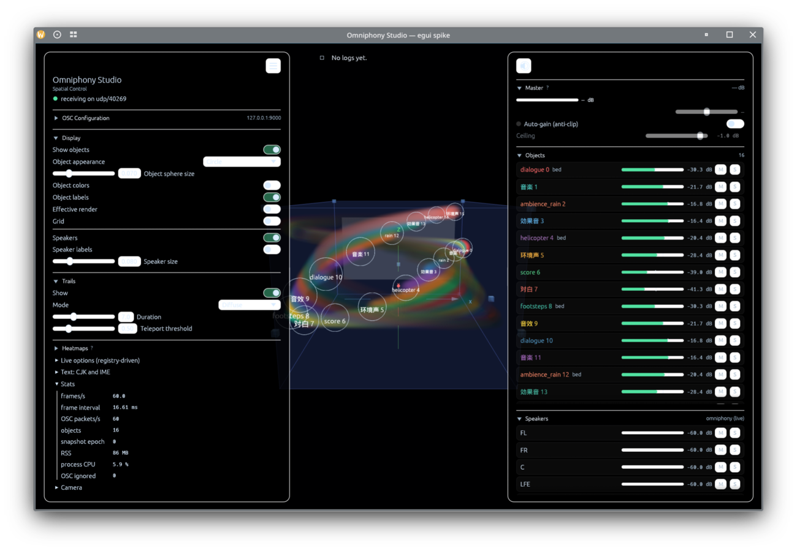

# omniphony-studio-egui

Native egui/wgpu host for Omniphony Studio, the replacement for the Tauri
web frontend. Phase 0 (the spike and its measurements) is documented in
[`docs/studio-native-ui-spike.md`](../docs/studio-native-ui-spike.md); phase 1
(viewport parity with the three.js scene) in
[`docs/studio-native-ui-phase1.md`](../docs/studio-native-ui-phase1.md), phase 2
(the panels) in
[`docs/studio-native-ui-phase2.md`](../docs/studio-native-ui-phase2.md).

The crate reuses the Tauri host's OSC parser, state model and domain-state
appliers verbatim (`src/osc/parser.rs`, `src/model/`, `src/osc/apply.rs`), so
both hosts speak the same protocol and keep the same state; the UI reads that
state directly instead of a camelCase JSON mirror.

## Layout

| Path | Role |
|---|---|
| `src/main.rs` | CLI, fonts (system CJK fallback face), eframe launch |
| `src/app.rs` | Panels, camera input, picking, gain-table subscriptions, stats |
| `src/osc/` | UDP listener, register/heartbeat, control channel; `dispatch.rs` applies events to the model |
| `src/model/` | `AppState`, `RoomRatio`, layouts (copied from `src-tauri`) |
| `src/host/` | What the Tauri host did outside the listener: the command handlers (ported), the OSC config, preferences, peak hold, timing stats |
| `src/ui/` | The Studio's look: theme, side-panel geometry, sections, generic widgets |
| `src/panels/` | The panels themselves, one module per group of sections |
| `src/i18n.rs` | Strings, resolved against the web Studio's `en.json` |
| `src/view/` | Model → frame: objects, speakers, room, trails, volumes |
| `src/render/` | wgpu renderer hosted by an `egui_wgpu::Callback`; camera; head glTF; volumes |

## Build and run

Requires Rust 1.95+ (`rust-toolchain.toml` pins 1.97.1 for this directory).

```bash
cd omniphony-studio-egui
cargo run --release -- --synthetic 24 --rate 100 --stats-interval 1
```

Flags: `--register host:port` (live renderer, read-only for audio),
`--listen-port N`, `--layouts-dir ../layouts`, `--layout-key 7.1.4`,
`--head-model path.glb`, `--cjk-font path`, `--object-field`, `--no-trails`,
`--no-vsync`, `--synthetic-stop-after S`.



`scripts/measure.sh [objects] [rate] [feed_secs]` reproduces the phase 0
gate measurements (frame rate under load, idle CPU, RSS).
