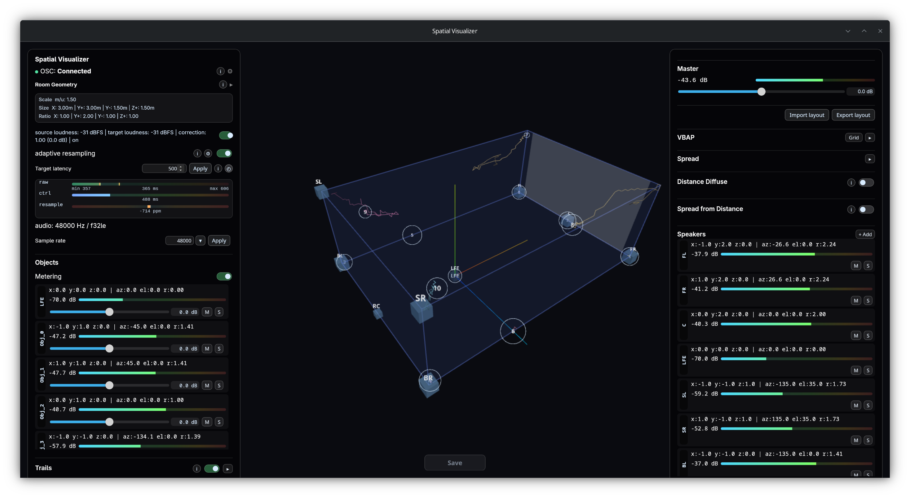

# Omniphony Studio



Omniphony Studio est l’interface de supervision, de visualisation 3D et de contrôle live de la suite Omniphony.

Le projet est conçu pour fonctionner avec `omniphony-renderer`, qui fournit le moteur temps réel, l’état OSC et les contrôles audio utilisés par le studio. Le studio ne produit pas le rendu audio lui-même : il sert d’interface de supervision et de pilotage pour `orender`.

## Principe

- Le studio écoute des messages OSC en UDP.
- Au démarrage, le studio envoie `/omniphony/register [listen_port]` vers `<host>:9000` pour s’enregistrer auprès du renderer.
- Tant qu’il est actif, le studio envoie `/omniphony/heartbeat [listen_port]` toutes les 5 secondes vers la même destination pour maintenir l’inscription côté renderer.
- Le studio affiche chaque source comme une sphère dans un volume 3D normalisé `[-1, 1]`.
- Le menu **Layout** permet de choisir la configuration d’enceintes chargée depuis `../layouts/*.yaml` et affichée dans la scène.

## Formats OSC supportés

Le studio accepte le format historique du prototype et des variantes avec identifiant embarqué dans l’adresse ou coordonnées sphériques.

### 1) Position cartésienne

```text
/source/position id x y z
```

### 2) Position cartésienne avec id dans l’adresse

```text
/source/<id>/position x y z
/object/<id>/position x y z
/channel/<id>/position x y z
```

### 3) Position sphérique

```text
/source/<id>/aed azimuth elevation distance
```

### 4) Suppression d'une source

```text
/source/remove id
/source/<id>/remove
```

## Lancer le projet

```bash
npm install
npm run tauri dev
```

`npm run tauri dev` lance l’app de bureau (Tauri + Vite). `npm run dev` sert uniquement le front Vite sur `http://localhost:5173` pour le développement UI.

## Tests

```bash
npm run test:math    # geometry parity against the Rust crate
npm run i18n:check   # translation key parity across locales
```

`test:math` replays golden vectors generated by `omniphony-geometry` through
`src/coordinates.js`. The JS keeps its own copy of the coordinate and
room-warp math because per-frame Three.js work stays in the browser; this is
what stops that copy drifting from the renderer's.

Regenerate the vectors after any change to the geometry — in either language:

```bash
cd ../omniphony-renderer
cargo run -p omniphony-geometry --example dump_golden_vectors \
  > ../omniphony-studio/scripts/golden/geometry.json
```

A change that makes the two disagree fails the run and prints each mismatch.

## Build Desktop

```bash
npm run tauri build
```

Le package embarque `orender` comme sidecar Tauri. Le script `prepare-sidecar` construit
automatiquement `omniphony-renderer` et copie le binaire dans `src-tauri/binaries/`.

### Note Arch / AppImage

Sur Arch, les bundles `.deb` et `.rpm` peuvent se générer correctement alors que l’AppImage
peut échouer au moment de `linuxdeploy`.

Vérifier au minimum :

- `fuse2`
- `patchelf`
- module noyau FUSE chargé (`modprobe fuse`)

Avec les libs système récentes d’Arch, `linuxdeploy` peut aussi échouer pendant le `strip`
des dépendances embarquées. Le workaround validé localement est :

```bash
npm run tauri:build:linux
```

Ce script applique `NO_STRIP=true` et permet de générer les trois formats, y compris l’AppImage.

## Notes de dev

- Vue 3D, sélection d’un HP :
  ne pas réutiliser tel quel le matériau normal des objets pour représenter les non-contributeurs. La sphère source de base est déjà chaude/orangée, donc même une version "normale mais estompée" peut être perçue comme rouge. Si on veut distinguer les contributeurs d’un HP sélectionné, il faut soit :
  - ne colorer que les contributeurs
  - soit mettre les non-contributeurs dans un état vraiment neutre ou quasi invisible
  - mais éviter de compter sur la seule baisse d’opacité du matériau source
- Overlay Studio / isolation de la vue 3D :
  les modules de contrôle ne doivent jamais conserver de refs DOM de panneau en variable globale de module. Pas de `const el = inRendererPanel(...)` ou équivalent au chargement.
  Toute résolution de nœud overlay doit se faire à l’usage via `panel-roots.js`, ou via des listeners délégués attachés au root du panneau.
  Raison : l’overlay peut remonter, remplacer ou réinitialiser des sous-arbres. Une ref capturée hors timing casse facilement la synchro UI et empêche d’isoler proprement le viewport 3D du reste du DOM.
  En review, considérer comme odeur d’architecture tout accès DOM persistant à un panneau monté dynamiquement.
- Couches compositeur au-dessus du canvas WebGL :
  aucun élément promu en couche compositeur GPU ne doit chevaucher `#omniphony-renderer-mount`. Ça inclut `filter`, et l'ajout d'un canvas supplémentaire au-dessus du canvas WebGL. Sinon : aliasing avec les `CanvasTexture` des sprites, labels qui affichent une copie du viewport ou une autre texture.
  Update (2026-06, WebKitGTK 2.52.4): `backdrop-filter: blur()` on the side/log overlays is allowed again, guarded by a canvas-scoped native-DnD block (the orbit-drag trigger). See `../docs/webgl-compositor-aliasing.md` → "Resolution" before touching it. The rule above still applies to every other compositor-promoting property.

## Messages envoyés par le studio vers le renderer

| Message OSC | Fréquence | Args |
|---|---|---|
| `/omniphony/register` | une fois au démarrage | `[int listen_port]` |
| `/omniphony/heartbeat` | toutes les 5 s | `[int listen_port]` |

## Heartbeat renderer

- `/omniphony/heartbeat/ack` : la session est valide.
- `/omniphony/heartbeat/unknown` : le studio se ré-enregistre automatiquement avec `/omniphony/register`.
- timeout d’ACK (> ~10 s) : le studio tente périodiquement un `/omniphony/register` jusqu’au retour des réponses.
